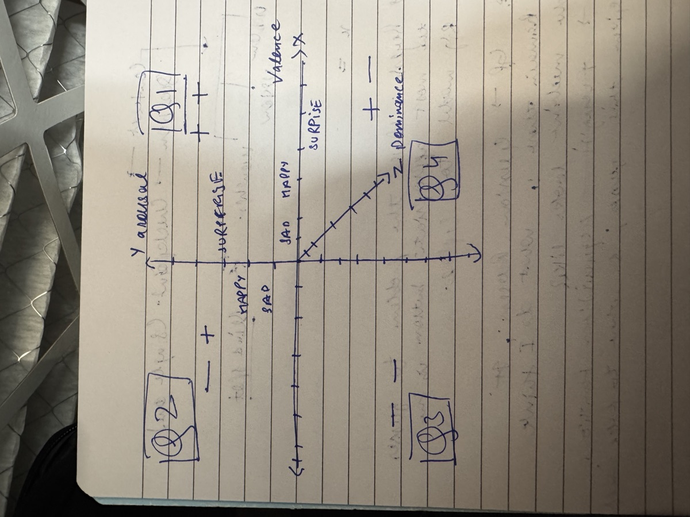

# JOURNEY.md — How This Project Was Built, Step by Step

> The chronological story of the Voice Emotion Engine: where we started, every
> major action, the tools we used, the problems we hit, and exactly how we solved
> each one. Read top-to-bottom, it's the narrative of how we reached a working
> dimensional emotion engine on a gold-standard corpus.
>
> Companion docs: `WRITEUP.md` (the results report) and `TRAJECTORY_ENGINE.md`
> (Phase-2 binding spec + laws). Phase-1's internal spec and experiment log are
> kept local; their substance is summarized in this file.

**The whole arc in one line:** text-based emotion extraction failed → we built a
*voice* feature engine → proved it on acted data → hit the acted-speech ceiling →
pivoted to a *dimensional* (PAD) model → secured a gold-standard corpus → and
proved that voice reads **arousal/dominance** well and **valence** only weakly,
with a trajectory engine on top.

---

## PHASE 0 — Why we started (the dead end behind us)

**The text ceiling.** The companion AI's original backend had a complete *text-based*
emotional-signal pipeline (appraisal lab, Ekman-6 inference, Naive-Bayes
classifier) — 4–5 months, 584+ commits. It hit a wall: people mask in text
(sarcasm, understatement, performative calm), and ~60% of signal leaked in the
pipeline. **Decision: freeze text, move to voice.** Voice doesn't lie the way text
does — pitch, jitter, and pauses leak emotion even when words don't.

**The first voice attempt failed too — 32% reliable.** Honest post-mortem of the
pre-March-2026 attempt found six root causes, and each became a rule for the rebuild:

| What went wrong before | The rule it created |
|---|---|
| Two disconnected experiments | One unified pipeline, zero leakage |
| Magic-number thresholds | Every threshold from data |
| 3-class mood (pos/neg/neutral) | Ekman-6 from day one |
| librosa as the feature extractor | openSMILE + Praat; librosa = utility only |
| No jitter/shimmer/HNR | Voice-quality biomarkers mandatory |
| No build log | Document every experiment |

That table is *why* Phase 1 looks the way it does.

---

## PHASE 1 — Building the voice engine (March 2026)

Goal: `audio file in → 111 acoustic features → emotion prediction out`, one
pipeline, no leakage, every number sourced.

### Step 1 — Clean bootstrap
- **Did:** nuked old code; created the venv and the directory structure.
- **Used:** Python 3.13; `opensmile` 2.6.0, `praat-parselmouth` 0.4.7, `librosa`
  0.11, `scipy`, `scikit-learn` 1.8, `numpy`, `matplotlib`, `soundfile`, `mypy`,
  `pytest`. Datasets: **RAVDESS** (1,440 files) + **CREMA-D** (7,442 files).
- **Problem:** CREMA-D's GitHub LFS quota was exceeded.
  **Fix:** pulled it from a Hugging Face mirror instead.

### Step 2 — Preprocessing (the single front door)
- **Did:** `preprocess()` = load → resample 16 kHz mono → trim silence → peak-
  normalize. Every downstream module calls this; nothing loads audio on its own.
- **Decisions:** 16 kHz (speech standard, CREMA-D's native rate); 25 dB trim
  (keeps soft speech, strips dead air); **explicit errors, never silent fallbacks**
  (the old pipeline's fatal habit). 16 tests.

### Step 3 — Features: openSMILE → Praat → prosody (104 → later 111)
- **Did:** eGeMAPS (88, the SER research standard) + Praat voice quality (jitter,
  shimmer, HNR, formants) + prosody (speech rate, pauses, tempo). Combined into one
  `build_feature_vector()`.
- **Used:** openSMILE (C++ singleton, fast), parselmouth (Praat = clinical gold
  standard for voice quality).
- **Problem:** openSMILE silently fills NaN for too-short segments.
  **Fix:** detect and raise `RuntimeError` instead of returning garbage.
- **Verified by inspection:** anger = highest shimmer + jitter; sadness = low F0 +
  loudness; happy/surprise = highest F0. The features carried real signal.

### Step 4 — Normalization + data-driven feature selection (104 → 93)
- **Did:** `FeatureNormalizer` = StandardScaler + remove zero-variance and
  |r|>0.95-correlated features. **Fit on train only** (no leakage); save/load so the
  exact transform applies at inference.
- **Why it mattered:** the old repo had features ranging 0.01–3000, which makes
  distance-based models useless. This was the minimum bar it had skipped.

### Step 5 — Dataset loader + full batch extraction
- **Did:** `dataset_loader.py` maps filenames → Ekman-6. Batch-extracted all of
  CREMA-D (6,355 Ekman-6 files in 4.6 min) and RAVDESS — **zero NaN/Inf, zero
  silent drops.**
- **Decision:** excluded neutral and calm (not Ekman-6 emotions). Surprise exists
  only in RAVDESS — documented imbalance.

### Step 6 — The classifier, and the first hard lesson
- **Did:** SVM and RandomForest on the features.
- **Result:** **RAVDESS 64.5%** (SVM), RF 63.2% — solidly in the "60–75% on acted
  speech" expectation. Confusion matrix was informative (surprise 84%, joy↔fear
  confused — shared arousal).
- **THE PROBLEM (cross-dataset collapse):** train on RAVDESS → test on CREMA-D
  dropped to **30.3%**. The model over-predicted sadness on a different acting style.
  **Diagnosis:** classic domain shift — the classifier learned RAVDESS's *acting
  style*, not emotion. **Fix:** train on combined data (RAVDESS+CREMA-D → 55%), and
  crucially — *the engine never changed*. This **validated the 3-layer architecture**:
  the engine is constant, the classifier is the swappable part.

### Step 7 — Signal mapper with sourced numbers
- **Did:** map Ekman-6 → valence/arousal/expression-strength.
- **Problem:** the initial centroids were *guessed*.
  **Fix:** replaced with **Warriner et al. (2013)** published norms for V/A, and
  computed expression-strength baselines from **288 RAVDESS neutral/calm files**.
  Every number now had a source.

### Step 8 — Reality check: own-voice test
- **Did:** ran the pipeline on real self-recorded speech (phone mic).
- **THE PROBLEM:** everything predicted **sadness**. Later, 185 files from 3
  speakers → 20.7% overall, but sadness 93.5%.
  **Diagnosis:** real conversational speech is calmer/slower than acted speech;
  the classifier learned "low energy = sadness" from actors. **This is the
  acted→natural gap** — a *classifier/training-data* limit, not an engine bug
  (the engine produced clean features on all 185 files, zero errors).

### Step 9 — Adding MELD, and the tuning non-result
- **Did:** added **MELD** (TV-show speech, 7,272 files) for more naturalistic data;
  ran grid-search hyperparameter tuning.
- **Result:** combined accuracy ~40–52%; **tuning moved accuracy ~0.4pp.**
  **The finding:** the ceiling is a *data* limitation (acted vs natural mismatch),
  not a model-knob problem. An important negative result.

### Step 10 — Hardening the engine (the "explosive steps")
A run of safety/robustness work that made Layer 1 production-grade:
- feature **validation** (raise on missing/NaN/Inf, warn on out-of-range);
- **confidence threshold** (low-confidence → neutral blend, flagged);
- **minimum-duration** guard with typed `AudioError`;
- **adaptive F0 range** (two-pass, per-speaker — fixes clipped pitch on high/low
  voices);
- new features: **formant bandwidth** (104→107) and **energy envelope /
  attack-decay** (107→111);
- expression-strength weights derived from RF importance (not guessed);
- a **cross-dataset feature-stability report** (formants stable <3% drift; MFCCs
  drift up to 200% — explains part of the cross-dataset collapse).

**End of Phase 1:** a hardened, dataset-agnostic **111-feature engine**, 116 tests,
a working categorical classifier — and a clear, documented ceiling: *the engine is
solid; categorical accuracy on natural speech is fundamentally limited.*

---

## THE PIVOT — From categories to coordinates (June 2026)

The categorical approach had hit its ceiling (~40% on mixed natural speech). The
insight: **stop forcing one label; predict the underlying dimensions instead.**
Move to the **PAD model** — Valence, Arousal, Dominance — treat emotion as a
*point in 3-D space*, track it over time as a *trajectory*.

*The founding sketch — the PAD plane as first drawn in a notebook (June 2026),
before any of this phase's code existed. X = valence, Y = arousal, the diagonal
Z = dominance. Everything that follows — the regressor, the centroids, the
trajectory engine, even Project 2's steering distance — happens inside this
drawing. The fine-tuned model's output space is still exactly this plane.*

- **Why 3-D (add dominance)?** It separates anger from fear, which collide in 2-D.
- **The central constraint named up front — "the valence problem":** acoustics give
  arousal and dominance; valence lives in *words* and is weak from voice alone. We
  predicted this would be the hard axis and committed to reporting it honestly.
- **Anti-drift discipline:** wrote `TRAJECTORY_ENGINE.md` — a binding spec with
  **14 laws** (keep the V/A/D triple, never a scalar; CCC not "accuracy";
  data-grounded centroids only; report distributions not forced labels; don't
  rebuild Layer 1; validate only on dimensional data; valence is weak — say so; …).
  This kept later work from quietly reverting to old habits.

**THE BLOCKER:** our datasets (RAVDESS/CREMA-D/MELD) are *categorical only* — no
V/A/D labels. You cannot validate a dimensional engine on them. We needed a
**dimensionally-annotated** corpus.

**How we solved the data problem:** requested academic corpora directly. Drafted
lab-request emails; **MSP-Podcast** (UT-Dallas, the field's largest naturalistic
dimensional corpus) was granted under an individual license — the corpus owner
approved and the university countersigned. The natural limitation was resolved
*legitimately*.

---

## PHASE 2 — The dimensional engine (June 2026)

### P2.0 — Add dominance (and catch a data-integrity bug)
- **Did:** extended the signal mapper to output the full **(V, A, D)** triple.
- **PROBLEM found:** the existing valence/arousal values *did not match* their cited
  Warriner source for any word form (arousal was systematically too high) — they
  were effectively unsourced.
  **Fix:** corrected the whole table to **verified Warriner CSV** values (pulled
  from the JULIELab/XANEW mirror when the original host had cert errors) and added
  dominance. Verified anger D=+0.04 > fear D=−0.42. 117 tests.

### P2.1 — The dimensional scaffold
- **Did:** built `src/dimensional/`: `metrics.py` (**CCC**/RMSE/Pearson),
  `regressors.py` (three independent V/A/D regressors, SVR/RF/Ridge, reusing the
  train-only normalizer), `namer.py` (**CentroidNamer** — data centroids +
  **Mahalanobis** distance → softmax distribution + intensity + ambiguity flag),
  `loader.py`. 140 tests. The whole pipeline ran on synthetic data, ready for real
  data the moment it landed.

### P2.2 — Get the corpus on disk and lock the loader
- **Did:** downloaded MSP-Podcast (~50 GB), extracted **267,905 WAVs** + labels.
- **Verified the loader against the *real* schema:** the actual
  `labels_consensus.csv` header was an **exact match** to the loader's column
  aliases — zero changes needed. Loader confirmed: 264,705 valid V/A/D rows.
- **Used:** `tar`/`unzip`, pandas. End-to-end smoke test: 5/5 clean 111-feature
  extractions on real MSP audio.

### P2.3 — The study (where the real numbers came from)

This phase had the most problems-and-solutions — the heart of the work.

**(a) The checkpoint bug.** Built `extract_msp.py` with checkpoint/resume. It
crashed at the first checkpoint (file 2,500).
  - **Diagnosis:** `np.savez` *silently appends* `.npz` to any path not ending in
    `.npz`, so the atomic-rename target didn't exist. The smoke test passed because
    it never reached a checkpoint.
  - **Fix:** name the temp file to end in `.npz`; recovered the 2,500 rows from the
    stray file (nothing lost); verified a clean round-trip before relaunching.

**(b) First real numbers — a brutal probe.** Extracted the Dev split (34k),
trained speaker-independent. Result: **arousal 0.624, dominance 0.567, valence
0.059.** Arousal/dominance were strong and literature-grade; valence was at the
noise floor — *the valence problem, confirmed in the starkest terms.*

**(c) Scope decisions (locked into law).** With the gold standard in hand, we made
deliberate calls: dropped the old backend-integration contract (independent experiment; output is
the V/A/D triple, ETV/EIV parked); **MSP is the primary spine**, all else
supplementary; **Phase-1 acted-speech numbers retired** (regenerate everything on
MSP); the gold standard is **empirical, not truth** (labels = mean of ≥5
annotators); naming uses the corpus's own set (**6 + contempt + neutral**), not an
Ekman-6 cage.

**(d) A negative result that saved a night.** Hypothesis: per-speaker
normalization would claw back valence. We tested it cheaply first — it **hurt**
(arousal −0.30, dominance −0.32). MSP labels are *absolute*; centering deletes the
between-speaker signal A/D depend on. **Lesson + corrected law:** speaker baselines
belong in *expression/intensity*, not absolute V/A/D regression. A 2-minute
experiment stopped a harmful transform from entering a 6-hour run.

**(e) The valence lever — the breakthrough.** Before committing to the big run, we
asked "can we *lift* valence, not just accept it?" Tested two cheap ideas:
**SVR** (the model classical valence baselines use) and **output calibration**
(rescale predictions to the target spread — the CCC-maximizing affine).
  - SVR on just 8k rows tripled valence (0.059 → 0.180); calibration added more.
  - **Diagnosis:** the valence signal was real but faint + nonlinear — Ridge
    (linear) couldn't see it, RF hedged to the mean (Pearson 0.22 vs CCC 0.11),
    **SVR could.** The "wall" was a *model-choice artifact*.

**(f) The definitive run.** Extracted the full **Train split (169k files, ~6 h,
68 checkpoints, fully resumable** — it even survived a laptop sleep mid-run).
Trained on Train, tested on Dev (canonical, speaker-independent), with **SVR +
calibration**:

| | Valence | Arousal | Dominance |
|---|---|---|---|
| **CCC** | **0.347** | **0.612** | **0.515** |

Valence arc end-to-end: **0.059 → 0.180 → 0.347 (6×)** — at/above the published
handcrafted-acoustic baseline. **Layer-4 separability: 42.4%** over the 8-class set
(chance 12.5%); data centroids confirmed the 3-D payoff (anger D=+0.41 vs fear
D=−0.01) and that **joy is the lone clearly-positive-valence emotion**.

### P2.4 — The trajectory engine
- **Did:** `TrajectoryEngine` — window audio (2 s / 1 s hop) → per-window V/A/D →
  EMA smoothing → centroid naming → timestamped path. Each window peak-normalized
  independently (matches training); failed windows recorded as **gaps, never
  dropped**.
- **PROBLEM:** a test with a deliberately-bad model produced V/A/D of 340 (off the
  1–7 scale).
  **Fix:** clamp predictions to the SAM 1–7 bounds before converting to PAD — a
  correct safeguard (the scale is bounded by definition). +11 tests → 160.
- **Demo:** 5-minute interview → **319 windows, 0 gaps**, full duration covered.
  Honest caveat: 304/319 windows ambiguous → the *continuous path* is the signal,
  not the discrete labels (the overlap ceiling at window level).

### P2.5 — The emotion web
- **Did:** `trajectory_viz.py` → a 4-panel figure: the 3-D PAD path colored by
  time, V-A and V-D projections with data centroids, and V/A/D-over-time. This is
  the differentiator — most SER shows one label per clip; this shows *movement
  through emotional space*.
- **Used:** matplotlib (Agg backend, 3-D + 2-D).

### P2.6 — The writeup
- **Did:** `WRITEUP.md` — a standalone technical/portfolio report with the thesis,
  method, results, the honest limitations, and reproducibility commands.

---

## PHASE 2.5 — Multi-speaker: can we tell people apart? (June 29)

A conversation has several people. Goal: split them and give each their own
emotion trajectory ("Speaker A / B / C").

### Attempt 1 — classical diarization (Path A)
- **Did:** `SpeakerDiarizer` — cluster windows on speaker-*stable* features
  (formants F1–F3, MFCC timbre, pitch range), deliberately **excluding pitch
  alone** (which failed in Phase 1). Tools: sklearn AgglomerativeClustering + silhouette.
- **Result:** on the `long_1` interview it auto-detected **2 speakers (correct count)**.
- **PROBLEM:** on a downloaded public-domain **1959 Kitchen Debate** it collapsed to
  1, and on controlled tests attribution was only ~**52% (a coin flip)** — because
  our features *leak emotion*, so one person who changes mood splits into two clusters.

### Building honest ground truth
- **Did:** `build_test_conversations.py` — stitched known RAVDESS actors into
  conversations with **exact who-spoke-when labels** (mixed-gender, same-gender,
  3-speaker, and a 1-speaker/many-emotion case). Random internet clips give no way
  to *measure* correctness; constructed clips do.

### Attempt 2 — neural diarization (Path B)
- **Did:** **ECAPA-TDNN speaker embeddings** (SpeechBrain) in an **isolated venv
  (`.venv_diar`)** so torch never touches the 170-test main engine — wired in via
  subprocess + file handoff (`diarize_neural.py`, `diarize_neural_demo.py`).
- **PROBLEM/fix:** first clustered embeddings with Euclidean distance — wrong;
  switched to **cosine** (L2-normalize), the correct metric for speaker embeddings.
- **RESULT (5 controlled audios):** attribution **Path A 52% vs Path B 79%**, and on
  the hard **same-gender** case **52% vs 90%**. On `long_1` ground truth (first 27 s =
  known single male): Path A purity **52%** (split one man in half) vs Path B **96%**.
  Decisive — learned embeddings separate speakers where hand-crafted features can't.
- **Honest remaining gap:** *auto speaker-counting* is unreliable for both methods
  (silhouette and a calibrated cosine threshold each ~1–2/5) — at 2-s windows the
  within-speaker spread ≈ between-speaker spread. Resolution: **specify the count**
  (usually known) → strong attribution; reliable auto-count needs full VAD +
  segmentation (pyannote), a future rung.

## PHASE 2.6 — The reality check that reframed the project (June 29)

Before going deeper on multi-speaker, we gated on the real question: **does the
emotion engine even work on a single speaker?**
- **Did:** end-to-end emotion accuracy on held-out single-speaker clips (Dev 27k +
  truly-held-out Test1 5k) — `eval_emotion_singlespeaker.py`, `train_direct_emotion.py`.
- **BRUTAL RESULT:** the centroid-naming pipeline scored **27% — *below* the 31%
  majority baseline**. A direct balanced-RF classifier hit 44–57% but **balanced
  accuracy only ~20%**, with **fear/disgust/contempt/surprise/sadness ≈ 0% recall** —
  it only detects neutral/joy/(weak)anger.
- **Coarse 3-level (low/mid/high):** arousal **58%**, dominance **53%**, valence **39%**.
- **Conclusion:** *fine 8-way emotion from voice does not work; arousal/dominance
  LEVEL does.* The engine's real product is the **continuous dimensional signal**, not
  fine discrete labels. No classical tweak fixes the 0%-recall emotions — they're
  acoustically subtle and valence-bound.

## PHASE 2.7 — A creative idea, honestly tested and set aside (June 29)

- **Idea:** a "Dolby-Atmos-inspired" clarity layer to help the model *hear* better →
  better extraction.
- **Honest diagnosis:** clarity is **not** our bottleneck — arousal works (58%) on the
  *same* audio where fine emotion fails, proving the audio is heard fine; the missing
  emotion info simply **isn't acoustic**. Also, Dolby's *spatial* 3-D ≠ our *emotional*
  3-D (a category error). Enhancement helps *degraded* audio (robustness) but can
  *erase* the micro-features (jitter/shimmer) emotion rides on. **Not pursued** — but
  a useful clarifying detour.

## PHASE 3 — Learned vectors break the valence wall (June 29)

The whole project kept hitting the **valence ceiling** (~0.35) with hand-crafted
features. This is where it broke.

### The fusion experiment
- **Idea (user's):** turn the audio into *learned vectors that fluctuate over time*
  and give the pipeline **both** that view and the waveform features.
- **Recognized as:** SSL embeddings (**WavLM**) + feature fusion — the known path past
  classical features. Built as a **child experiment in the isolated env**
  (`exp_ssl_fusion.py`); installed `transformers` there, kept the main engine clean.
- **RESULT (same 5k train / 2k held-out, apples-to-apples):** valence **classical 0.10
  → SSL 0.34 → fused 0.33** — *tripled on equal footing*. SSL on **5k matched our best
  classical valence on 169k** (34× more data-efficient). **Fusion best overall.**

### Integration into the main pipeline + scaling
- **Did (safely):** graduated SSL-fusion into the pipeline with torch **quarantined in
  `.venv_diar`**, orchestrated via subprocess + cached `.npy` — main venv never gets
  torch, **170 tests stay green**. New: `extract_ssl.py`, `train_fused.py`
  (→ `models/dim_fused_msp`), `embed_files.py`, `predict_fused.py`. Scaled to 15k train.
- **RESULT (held-out Test1):** classical V 0.186 / A 0.663 / D 0.562 →
  **FUSED V 0.444 / A 0.717 / D 0.613**. The fused engine on **15k beats our classical
  engine on 169k on every axis** (valence 0.44 vs 0.35). End-to-end on real own-voice
  clips: the **Phase-1 all-sadness bias is GONE** (001→joy, 008/003→neutral, sensible
  V/A/D).

### The GPU step
- **Why:** frozen-embedding + linear head plateaus; the real SOTA is **fine-tuning
  WavLM end-to-end** (adapts the representation to MSP) — which needs a GPU.
- **Did:** wrote `finetune_wavlm.py` — WavLM-large + a V/A/D regression head + **CCC loss**,
  OneCycle LR, bf16, CNN feature-extractor frozen; trains on Train, validates on Dev each
  epoch, final eval on held-out Test1. All heavy work on a rented **RunPod** pod over SSH;
  the trained model comes back to the local pipeline.

## PHASE 3.1 — Fine-tuning WavLM on the GPU: the valence wall falls (June 30)

The plan from the night before was to resume on a rented GPU. What actually happened, in order:

### Getting the data onto the pod (the compliant way)
- **Constraint, respected:** MSP-Podcast is licensed no-redistribution voice data. It must
  **not** be routed local→pod through the assistant (that reads as exfiltration). The clean
  path is **portal→pod**: the pod downloads straight from the official MSP portal with the
  user's credentials. Credentials were entered into `wget` commands run **on the pod**, never
  saved anywhere.
- Deployed an **A100-SXM 80 GB** (the user's call — overkill in the best way: batch 32 native,
  fastest option, ~$1.51/hr). Verified GPU, copied the trainer, installed deps (PyTorch 2.8 +
  CUDA was already present; added transformers/soundfile/librosa/pandas).
- Downloaded `Labels.zip` (87 M, verifies the login fails-fast) then `Audios.tar.gz` (37 G) —
  both pod→portal at ~60 MB/s.

### Problem: the volume quota, and a corrupted extraction
- First `tar xzf` **failed halfway with "Disk quota exceeded."** The pod's `/workspace` volume
  caps around ~70 G; the 37 G tarball **plus** ~44 G of extracted audio together overflow it.
- The damage was subtle and dangerous: **88,984 needed files extracted as zero bytes** — files
  that *exist* but are empty. An existence check would have passed; training would have crashed
  or learned garbage. Caught it by checking file **sizes**, not just presence.
- **Fix — stream-extract:** `wget -O - | tar xz` pipes the download straight through tar so the
  37 G tarball never lands on disk. Peak usage ~45 G instead of ~83 G — fits the quota with room.
  Re-extracted clean: **271,106 files, 0 empty, all 249,883 needed (Train+Dev+Test1) verified
  present and non-zero.** *(Not a hack — the standard way to unpack a large archive without
  doubling disk. The data is byte-for-byte identical.)*

### Problem: two runtime bugs, caught by a 2-minute smoke test
Before committing to a multi-hour run, ran a 256-sample / 1-epoch smoke test. It paid for itself:
- **"Too many open files"** — the 34k-sample eval with 8 DataLoader workers exhausts file
  descriptors. Fixed with `torch.multiprocessing.set_sharing_strategy("file_system")` + a raised
  `ulimit -n`.
- **Buffered logs** — under `nohup`, Python buffered stdout so progress never appeared. Relaunched
  with `PYTHONUNBUFFERED=1 setsid nohup …` so logs stream live **and** the run survives SSH drops.
- Also hardened the dataset to **skip** any unreadable/truncated file instead of crashing a 3-hour
  run.

### The result
Training ran ~3 hours (2.2 steps/s, ~40 min/epoch, ~$4.50). The loss (1 − CCC) fell from ~1.0 to
~0.19. The Dev CCC climbed every epoch; the best checkpoint auto-saved.

- **Held-out MSP Test1 (46,294 clips, never seen): valence 0.705 · arousal 0.714 · dominance
  0.626 · mean 0.681.**
- **The valence arc, complete: 0.10 → 0.35 → 0.44 → 0.705.** A **7×** lift on the held-out set;
  SOTA-competitive on MSP-Podcast. The axis everyone (including us) called the structural ceiling
  is no longer the weak one — it now *leads* with arousal.
- Pulled the model back to `models/wavlm_vad_ft/` (verified by actually loading the 488 tensors,
  not just checking the file exists). Wired local inference: **`scripts/predict_wavlm_ft.py`**
  runs in the isolated `.venv_diar` (torch 2.12 + transformers 5.12, exact pod match, Apple-GPU
  MPS) — audio → V/A/D → PAD → the 8-class centroid namer.
- **Own-voice reality check (honest):** valence *signs* are now correct on real speech —
  happy → joy, sad → sadness; the Phase-1 all-sadness collapse is **gone**. But arousal
  compresses on amateur *acted* phone clips, so anger/fear can slump toward sadness — an
  acted-vs-natural domain gap, not an engine fault. The held-out MSP number is the trustworthy one.

## PHASE 3.2 — Naming the emotion + who's speaking: retrieval, a hybrid, and honesty (July 1)

The fine-tuned model reads V/A/D. But the everyday question is blunter: *which of the
six families is this, and who said it?* This phase built that — and produced a
counter-intuitive result worth keeping.

### "Shazam for emotion" — retrieval, not retraining
- **Did:** instead of squeezing a clip to V/A/D and naming by centroid, name it by
  **matching the full embedding** against a growable database of labeled exemplars
  (cosine k-NN). Corpus 1 = a frozen backbone that only ever *embeds*; Corpus 2 = a
  vector DB you *grow* by embed-and-store. No gradient training, so it can never
  forget. `scripts/retrieval_namer.py`.
- **Why it matters:** matching the full vector rescued **fear**, which V/A/D naming
  collapsed (acted fear 0% → 73% in-domain).

### The counter-intuitive finding: frozen beats fine-tuned (for retrieval)
- **Did:** head-to-head on 175 real own-voice clips (2 speakers), **leave-one-speaker-out**
  — the honest "name a stranger" test. `scripts/exp_emotion2vec.py`, `scripts/exp_head_vs_knn.py`.
- **RESULT (cross-speaker):** frozen **emotion2vec-kNN 63.4%** > our fine-tuned
  **WavLM-kNN 52.6%**. Fine-tuning WavLM made it a superb *regressor* but **narrowed
  its embedding space for cosine retrieval** on new speakers. On WavLM the fix is a
  **trained head** (68.0%), not kNN — a measured cost of fine-tuning, not an assumption.

### The hybrid: two backbones back each other up (at the decision level)
- **Did:** average the two 6-way family distributions — emotion2vec via kNN, WavLM via
  a logistic head. **Anti-mix law:** the vector spaces are *never* mixed (cosine between
  a WavLM and an emotion2vec vector is meaningless); only the distributions are fused.
  `scripts/exp_hybrid.py`.
- **RESULT (cross-speaker, LOSO):** **hybrid 68.6% (equal weight)** > either backbone
  alone. Per-family recall: sadness 90% · joy 86% · surprise 70% · anger 69% ·
  neutral 57% · **fear 47% (the weak point)**. (A weight-tuned 72.6% exists but is
  *directional only* — tuned on the same tiny set it reports on.)

### Packaged: two non-mixable adaptors + a one-command hybrid you can enroll into
- **Did:** `scripts/adaptors.py` — each backbone gets its own **tagged, non-mixable**
  database (`models/adaptors/{wavlm_ft,emotion2vec_plus_large}/`); loading asserts the
  tag so mixing is structurally impossible. Added a routable **`--use-case hybrid`** mode
  and an **enroll-a-speaker** path: enrolling grows *both* DBs and refits the head in
  <1s — no retraining. One command:
  `.venv_diar/bin/python -m scripts.adaptors predict --use-case hybrid clip.wav`.

### Who's speaking — diarization, honestly
- **Did:** ECAPA-TDNN speaker embeddings + clustering on stitched multi-speaker convos.
- **RESULT:** with speaker count **known**, ~100% per-turn attribution (2-speaker demo);
  with **auto** count, 78–90% (2 speakers) dropping to ~60% (3) — and auto speaker-**counting**
  is the unreliable link. Identity separation is solid; counting talkers from scratch is not.

### What this phase honestly cost / couldn't do
- **Fear→sadness** persists (47% recall), often *confidently*. **Per-speaker gap** is real
  (78.7% vs 63.0% across the two speakers) — 2 speakers is indicative, not population-level.
- Numbers verified live from cached embeddings this session; full report in **`WRITEUP.md`**
  (§5.3, §6) and the one-page **`RESULTS_AT_A_GLANCE.md`**.

## PHASE 3.3 — Adversarial stress test: 19 hostile inputs vs every path (July 3)

Before starting the two follow-on projects (RFE/MRE), we attacked our own engine with the
worst inputs we could construct, ran **all three paths** (classical pipeline, fine-tuned
WavLM V/A/D, hybrid namer) on each, and recorded what held and what didn't. Artifacts:
`out/stress_test/` (clip generator + both harnesses + full per-clip JSON).

**The 19 attack clips:** pure silence · white noise · 440 Hz tone · DC offset · synth chord
("instrumental" proxy) · 0.1 s fragment · 0.6 s borderline · a single sample · hard-clipped
speech (25× gain) · −60 dB whisper · −5 dB SNR (noise louder than speech) · 8 kHz container ·
stereo file · sparse bursts in silence · reversed speech · empty file · random bytes as .wav ·
truncated WAV · text file renamed .wav.

### What HELD (the original laws, verified under attack)

- **Zero crashes, zero NaN/Inf, zero silent drops on the classical path: 19/19** — 14 valid
  predictions + 5 explicit typed errors (`AudioError: too short` for 0.1 s and 1-sample;
  `RuntimeError: failed to decode` for empty/garbage/text files). Exactly the zero-leakage
  contract from Phase 1.
- **Deep paths NaN-free and in-range** on every decodable clip; corrupt containers rejected
  explicitly by both (`LibsndfileError` / ffmpeg failure).
- **Real-world degradations all absorbed:** stereo (downmixed), 8 kHz (resampled), −60 dB
  whisper, hard clipping, −5 dB SNR, reversed speech, sparse bursts, truncated-but-decodable
  WAV — every one produced structurally valid output on every path.
- **Layer-1 range validation fired exactly where it should:** F0 = 0 warnings on
  silence/DC, out-of-range HNR on noise/tone. The instrumentation is alive.

### What the test EXPOSED (3 real gaps + 1 refuted fix)

1. **No no-voice gate — the biggest gap for the "random uploaded audio" use case.**
   Non-voice audio gets *confident emotions* from every path: silence → sadness@0.36
   (classical), white noise → sadness@0.80, **synth chord → sadness@0.90** (hybrid). The
   classical junk-confidence (0.357) sits *above* the 0.30 low-confidence threshold, so the
   `low_confidence` flag never fires on junk. The engine answers "which emotion?" without
   ever asking "is this a voice?"
2. **The obvious fix is refuted — measured, not assumed.** We tested gating on embedding
   similarity: junk clips score top-1 cosine **0.98** against the exemplar DB — as high as
   real speech (kNN confidence is vote-share, not evidence; SSL embeddings live on a tight
   manifold). **But Layer 1 already caught every junk clip** (voiced_fraction ≈ 0, F0 = 0 on
   exactly those files). The no-voice detector exists in the handcrafted features — it just
   isn't enforced as a gate. Fix belongs in the additive serving layer: voicedness gate from
   Layer 1 *before* any model answers.
3. **The deep path lacks Phase-1's duration hardening.** A 0.1 s fragment: classical
   correctly raises `AudioError`; WavLM-ft **silently predicts**. A single sample: cryptic
   crashes (`Calculated padded input size per channel: (1)` / `len() of a 0-d tensor`)
   instead of typed errors. The two paths enforce different contracts for identical input.
4. **The deep model's loading is misuse-prone — a silent-failure hazard we triggered
   ourselves.** `WavLMRegressor`'s constructor does **not** attach `head.pt` (main() loads it
   separately); our first harness forgot it and got plausible-shaped, near-constant garbage
   (V≈const for all 19 clips) with **no error raised**. The one failure mode this project
   swore off — silent garbage — is reachable through the inference API if used wrong.

### Verdict (the gate for starting RFE/MRE)

**Crash-safety and NaN-freedom: 100% verified under attack — the Phase-1 laws held.** The
gaps are all of one kind: *the engine never asks whether the audio is a voice, and the deep
path skipped Layer-1's input hardening.* All four fixes live in the **additive serving layer**
already planned as the next module (voicedness gate → duration guard → owned model loading →
canonical packet) — zero changes to frozen code. Green light to proceed, with the serving
layer's job description now written by the stress test itself.

---

## THE TOOLBOX (everything we used, and why)

| Tool | Role |
|---|---|
| **openSMILE** (eGeMAPS) | Primary feature extractor — 88 SER-standard features |
| **parselmouth / Praat** | Clinical voice quality — jitter, shimmer, HNR, formants |
| **librosa / soundfile** | Audio load, resample, trim (utility only) |
| **scikit-learn** | SVR / SVM / RandomForest / Ridge, GridSearchCV, GroupShuffleSplit, StandardScaler |
| **numpy / pandas** | Arrays, feature matrices, tabular analysis |
| **matplotlib** | Spectrograms, confusion matrices, the emotion web |
| **joblib** | Model persistence |
| **pytest** | 170 tests across every module |
| **ffmpeg** | Converting real recordings to 16 kHz mono WAV |
| **MSP-Podcast v2.0** | The gold-standard dimensional corpus (264k segments) |
| **SpeechBrain (ECAPA-TDNN)** | Neural speaker embeddings — Path B diarization |
| **transformers + WavLM** | Learned audio vectors (SSL) — the valence breakthrough |
| **emotion2vec (FunASR)** | Frozen emotion-specialized embedder — best cross-speaker retrieval; the "stranger" adaptor |
| **Retrieval namer + adaptors** | Growable exemplar DBs, tagged non-mixable; routable hybrid + speaker enrollment |
| **PyTorch** | Backbone for ECAPA/WavLM — **quarantined in an isolated `.venv_diar`** |
| **Isolated venv + subprocess handoff** | Keep heavy deep-learning deps off the 170-test main engine |
| **RunPod (A100-SXM 80 GB)** | GPU that fine-tuned WavLM end-to-end (Phase 3.1) — ~3 h, ~$4.50 |

---

## EVERY PROBLEM WE HIT, AND HOW WE SOLVED IT

| # | Problem | Solution |
|---|---|---|
| 1 | Prior attempt 32% reliable | Clean rebuild: one pipeline, data-driven thresholds, openSMILE+Praat, Ekman-6, build log |
| 2 | CREMA-D LFS quota exceeded | Hugging Face mirror |
| 3 | openSMILE NaN on short clips | Detect + raise, never return garbage |
| 4 | Features on wildly different scales | StandardScaler + correlation-based selection, train-only |
| 5 | Cross-dataset collapse 64.5%→30.3% | Diagnosed domain shift; train on combined data; engine unchanged (validated 3-layer design) |
| 6 | Own-voice "all sadness" | Identified acted→natural gap (classifier limit, not engine) |
| 7 | Hyperparameter tuning did nothing | Finding: data-limited, not model-limited |
| 8 | Categorical ceiling on natural speech | Pivoted to dimensional PAD |
| 9 | No dimensional dataset | Secured MSP-Podcast via academic license |
| 10 | Signal-mapper values unsourced | Corrected to verified Warriner CSV |
| 11 | `np.savez` checkpoint crash | Temp name must end in `.npz`; salvaged the 2,500 rows |
| 12 | Valence near-zero (0.059) | Diagnosed as model choice → SVR + calibration → 0.347 (6×) |
| 13 | Per-speaker norm hurt A/D | Negative result; corrected the law (speaker baseline ≠ regression input) |
| 14 | Trajectory predicted off-scale values | Clamp to SAM 1–7 before PAD conversion |
| 15 | Phase-1 F0 speaker-split failed | Cluster on vocal-tract features, then on neural ECAPA embeddings — not pitch |
| 16 | ECAPA clustered with wrong distance | Switch to cosine (L2-normalize) → 79% attribution (90% same-gender) |
| 17 | Auto speaker-counting unreliable (both methods) | Specify the count; reliable auto-count needs VAD+segmentation (pyannote) |
| 18 | Fine 8-way emotion from voice ≈ 0% on rare classes | Reframe: the dimensional engine is the product; SSL for the rest |
| 19 | "Clarity"/Dolby idea | Diagnosed NOT the bottleneck — arousal works on the same audio; info isn't acoustic |
| 20 | Valence wall (~0.35 classical) | WavLM SSL fusion → 0.44 frozen → **fine-tuned end-to-end → 0.705 (held-out)** |
| 21 | torch would bloat/risk the main engine | Quarantine in isolated `.venv_diar` + subprocess handoff (170 tests stay green) |
| 22 | Licensed audio can't go local→pod | Download portal→pod directly (compliant); credentials only in `wget` run *on the pod* |
| 23 | Volume quota killed the untar — 89k **empty** files | Stream-extract `wget -O - \| tar xz` (no tarball on disk); verify file **sizes**, not just presence |
| 24 | DataLoader "too many open files" on 34k eval | `set_sharing_strategy("file_system")` + raised `ulimit -n`; caught by a 2-min smoke test |
| 25 | Buffered logs / SSH-drop risk on a 3 h run | `PYTHONUNBUFFERED=1 setsid nohup …` — live logs, survives disconnects; skip bad files mid-run |
| 26 | V/A/D naming collapsed fear (0%) | Retrieval: match the full embedding (kNN), not the squeezed V/A/D → fear 73% in-domain |
| 27 | Fine-tuned WavLM retrieves worse than frozen emotion2vec (52.6% vs 63.4%) | Score WavLM with a trained head (68%), not kNN; fuse both at the decision level → hybrid 68.6% |
| 28 | Mixing two backbones' vectors is meaningless | Anti-mix law: separate tagged DBs; fuse only the 6-way distributions, never the vectors |
| 29 | Non-voice audio (silence/noise/music) gets confident emotions — chord→sadness@0.90; junk conf 0.357 slips past the 0.30 low-conf flag | Stress test exposed it; embedding-similarity gate REFUTED (junk sims 0.98); Layer-1 voicedness (voiced_fraction/F0) already detects it → enforce as gate in serving layer |
| 30 | Deep path skips Phase-1 input hardening — 0.1 s silently predicts, 1 sample crashes cryptically | Duration guard (0.5 s law) must wrap ALL paths, not just classical → serving layer |
| 31 | `WavLMRegressor` without `head.pt` returns plausible silent garbage (no error) | Proven by our own harness bug; serving layer owns model loading so misuse is impossible |

---

## WHERE IT LANDED (so far)

**Voice reliably reveals how *activated* and how *in-control* a speaker is; whether
they feel *good or bad* is the hard axis — because valence lives in language.**
Proven on a gold-standard corpus, speaker-independent, with a trajectory engine,
visualization, and a validated multi-speaker distinguisher on top.

The arc of the headline number (valence CCC), each step earned:
- Classical hand-crafted features: **0.10 → 0.35** (model choice: SVR + calibration + data)
- WavLM SSL fusion (frozen), **15k clips: 0.44** — beating classical-on-169k on every axis
- **Fine-tuning WavLM end-to-end (A100, held-out Test1): 0.705** — the wall is gone

Arousal climbed in step (0.60 → 0.71), dominance too (0.49 → 0.63). The Phase-1
all-sadness bias is gone. Every number sourced; every dead end logged.

**The valence problem — the constraint that defined Phases 2 and 3, the reason we kept
saying "whether you feel good or bad lives in words, not voice" — is solved.** Fine-tuned
WavLM reads valence from audio alone at CCC 0.705 on 46k held-out clips it never saw. It
is no longer the weak axis.

On top of the dimensional engine, Phase 3.2 added an **emotion namer** (retrieval + a
frozen/fine-tuned **hybrid**, ≈ 69% cross-speaker, chance 17%) and a **speaker
distinguisher** (ECAPA diarization) — packaged as routable, enrollable adaptors. Where it
fails (fear→sadness; a per-speaker gap), it fails *legibly* and it's written down. The
package is complete: `WRITEUP.md`, one-page `RESULTS_AT_A_GLANCE.md`, 21 verified
citations in `REFERENCES.md`.

---

*Phase 1 started 2026-03-17 · Phase 2 completed 2026-06-29 · Phase 3.1 (SSL + fine-tuning)
2026-06-29 → 2026-06-30 · Phase 3.2 (naming + hybrid + diarization) 2026-07-01 · Phase 3.3
(adversarial stress test: laws held, no-voice gate + serving-layer spec derived) 2026-07-03 · Engine:
111 hand-crafted features + fine-tuned WavLM-large + frozen emotion2vec · Data: MSP-Podcast
v2.0 + 175 own-voice clips · **Headline: held-out Test1 V 0.705 / A 0.714 / D 0.626 (CCC),
valence 0.10 → 0.705 (7×); hybrid emotion naming ≈ 69% cross-speaker.***
